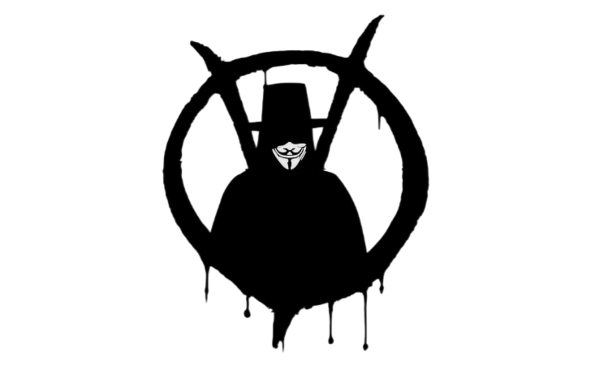

# V4War

<p align="center">
  
</p>

**Once ozgurluk.**

V4War, internet ozgurlugu mucadelesi icin gelistirilmis bir Android istemcisidir.
Misyonu nettir: sansur, trafik manipulasyonu ve baglanti kisitlari altinda
kullanicinin kendi ag rotalari uzerindeki kontrolunu korumasina yardim etmek.

V4War bir VPN saticisi degildir ve hazir erisim satmaz.
Kendi profil/proxy altyapisini yoneten kullanicilar icin teknik bir istemcidir.

---

English documentation: **[README.md](./README.md)**

## Neden V4War

- Sansure dayanikli, kullanici kontrollu rota yonetimi
- Hizli profil import ve abonelik guncelleme akislari
- Modern hibrit cekirdek ile protokol esnekligi
- Guvenilirlik ve kontrol odakli Android deneyimi

## Cekirdek Mimari

V4War, **hibrit cekirdek mimarisi** kullanir:

- **V2Ray ekosistemi uyumlulugu** ile genis profil formati destegi
- **sing-box cekirdegi** ile modern routing ve calisma davranisi

Bu tasarim, uyumluluk ve performansi tek bir Android odakli istemcide birlestirir.

## Desteklenen Protokol Aileleri

V4War; VLESS, VMess, Trojan, Shadowsocks, SOCKS/HTTP tabanli profiller
ve iliskili modern formatlar dahil olmak uzere yaygin protokol ailelerini destekler.

## Proje Kimligi

- Uygulama adi: `V4War`
- Paket adi: `tr.theyusa.v4war`
- Gelistirici: `TheYusa`
- Isim ve marka haklari: `TheYusa`

## Derleme (Android)

### Gereksinimler

- JDK 21
- Android NDK `29.0.14206865`
- Go surumu: `buildScript/init/version.sh` ile uyumlu olmali

### 1) Kaynagi al

```sh
git clone https://github.com/theyusa/V4War.git --depth=1
cd V4War
```

### 2) Android icin libcore derle

```sh
make libcore_android
```

Uretilen cikti:

```text
composeApp/libs/libcore.aar
```

### 3) Geo varliklarini indir

```sh
make assets
```

### 4) OSS lisans metadata dosyasini uret

```sh
./gradlew :composeApp:exportLibraryDefinitions
```

### 5) APK derle

```sh
make apk
```

APK cikti dizini:

```text
androidApp/build/outputs/apk
```

## Katki

Lutfen **[CONTRIBUTING.md](./CONTRIBUTING.md)** dosyasini okuyun.

## Lisans

`GPL-3.0-or-later`
